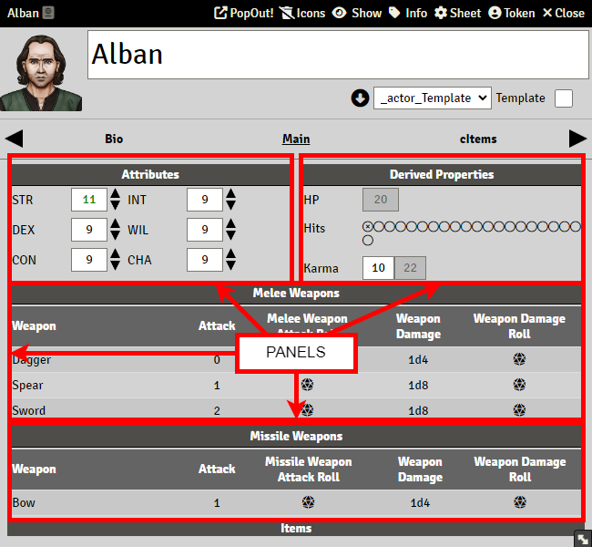
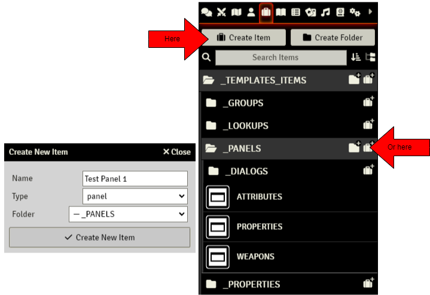

# Panels

> These pages are under construction, if needed, please refer to the previous [README](readme_previous.md)

Panels are elements that hold Properties, and are contained in Tabs. They are very important for sheet layout purposes:

Creating a Panel is very simple. Just press the "Create Item" Button and select "panel" from the list. Name it, and create it.

A new panel has three submenus: Description, Details, and Properties
