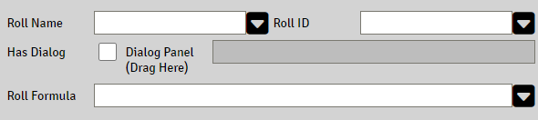
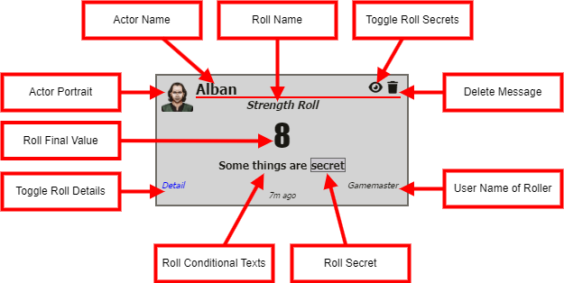
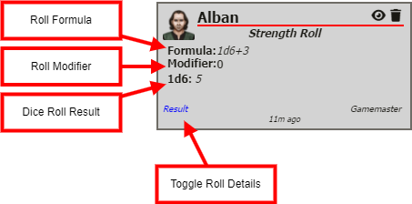

# Rollable Properties

A property that has the attribute `Rollable` enabled displays an additional panel to configure the roll to be triggered by clicking the property's label.

### Roll Name

The text to present as title in the rolled chat message.
This field accepts [Expressions](sandbox_expressions.md)

### Roll ID

This is the main roll ID, an identifier or Key that the roll will belong to. It does not have to be unique, so if your system has a lot of skills and this is a roll for one of them, you just can use "skill" as roll ID. 

This ID can be used by a cItem MOD to modify the roll, see [cItems](citems.md) and [Roll IDs](roll_expressions.md#roll-IDs)

### Has Dialogs

To enable Roll Dialog for this roll, check the `Has Dialog` 

#### Add dialog to roll expression

Drag and drop the dialog panel to the property.

Use the dialog panels property  as  `d{dialog_property}`in the Roll Formula, see [Roll Dialogs](roll_dialogs.md)

### Roll Formula

A valid [Roll Expression](roll_expressions.md)

## Roll Chat Message

When a Roll is executed, a chat message is created.

### Roll Chat Message basic layout

#### Actor Name

The name of the actor that the roll came from

#### Actor Portrait

The actors portrait

#### User Name

The name of the user who did the roll

#### Roll Name

See [Roll Name](#roll-name) above

#### Roll Final Value

The rolls final value, see [Roll Value](roll_expressions.md#roll-value)

#### Roll Conditional Texts

Conditional text generated by the roll formula, see [Conditional texts](roll_expressions.md#conditional-texts)

#### Roll Secret

Parts of a conditional text that is marked as secret for players, see [GM Secrets in conditional texts](roll_expressions.md#gm-secrets-in-conditional-texts)

#### Toggle Roll Details

Click to show the Roll Details.

#### Delete Message

Deletes the chat message.

### Roll Details 

#### Roll Formula

The actual die formula used in the roll.
Using [Registration Helpers](roll_expressions.md#registration-helpers) for rolls will hide them from showing up here.

#### Roll Modifier

Roll Modifier(see [Sandbox Settings](sandbox_settings.md#show-roll-modifier)) used for the final result

#### Dice Roll Result

Outputs actual die rolls results.
Using [Registration Helpers](roll_expressions.md#registration-helpers) for rolls will hide them from showing up here.
