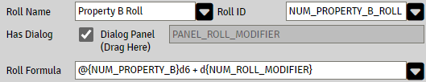
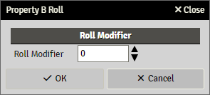

# Rollable Properties

A property that has the attribute `Rollable` enabled displays an additional panel to configure the roll to be triggered by clicking the property's label.


### Roll Name

The text to present as title in the rolled chat message.
This field accepts [Expressions](sandbox_expressions.md)

### Roll ID

This is the main roll ID, an identifier or Key that the roll will belong to. It does not have to be unique, so if your system has a lot of skills and this is a roll for one of them, you just can use "skill" as roll ID. 

This ID can be used by a cItem MOD to modify the roll, see [cItems](citems.md)

### Has Dialogs

To enable Roll Dialog for this roll, check the `Has Dialog` 

### Roll Formula

A valid [Roll Expression](roll_expressions.md)

## Roll Dialogs

When using a dialog panel in a roll expression, the user gets presented with a dialog for input before the roll is executed.

Please note that it is **not** possible to load any actor data **to** a dialog, only collecting user input **from** a dialog into a roll expression.

If the user clicks **Cancel** in this dialog the roll is cancelled.

The properties in the dialog can be used in the roll expression as any other property and are accessed with the following format

```
d{property_key}
```

Example.





The dialog panel can be a multi-panel with panels inside as well

Example.


### Create Roll Dialog

Create panel for dialog, this is done as any normal panel with properties etc except it is not added to the actor template

### Add dialog to roll expression

Drag and drop the dialog panel to the property.

Use the dialog panels property in roll expression