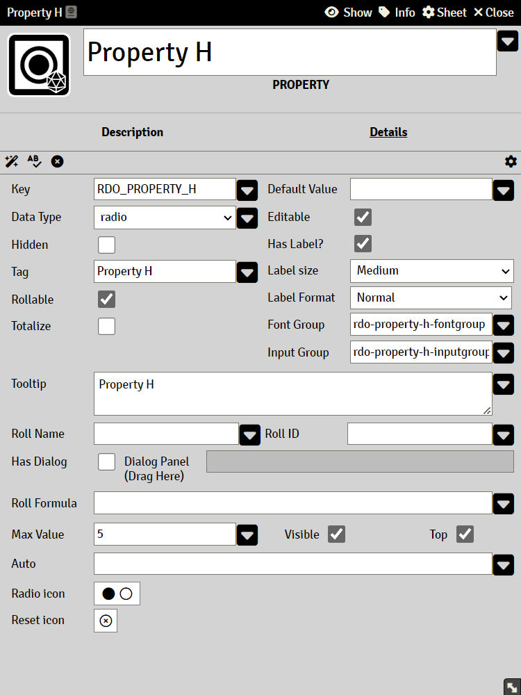

# Property Radio

Data stored in this property is integer numbers and can only contain whole numbers.

#### Max Value

The maximum value that the property can have. This field accepts [Expressions](sandbox_expressions.md)

It sets the maximum circle radio buttons to be displayed (radio buttons like in the Vampire the Masquerade character sheets).

### Auto

A valid Common Expression, see [Expressions](sandbox_expressions.md)

A property with an Auto will rendered as read-only.
