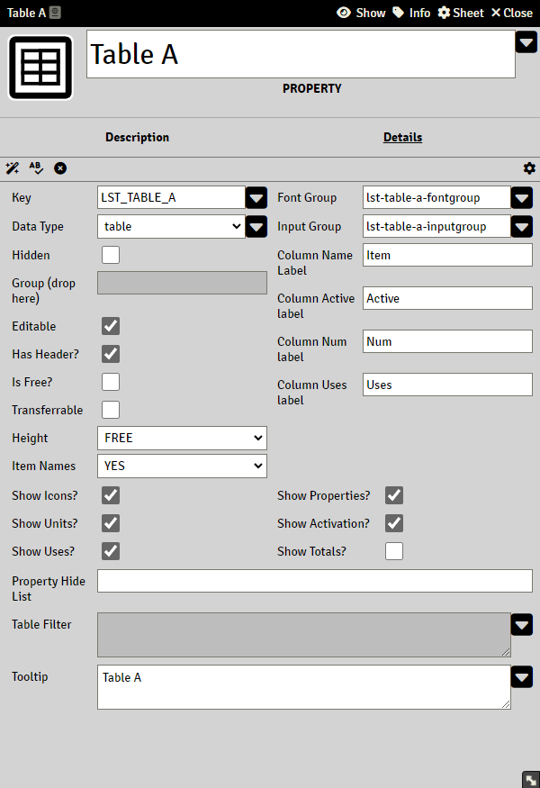

# Table Property

> These pages are under construction, if needed, please refer to the previous [README](readme_previous.md)

Table is a special property type and comes in two flavors,

- Standard Tables
- Free Tables

## Standard Table

## Free Tables

## Table totals

To get the total of a table, use `@{tableKey.totals.citemKey}`