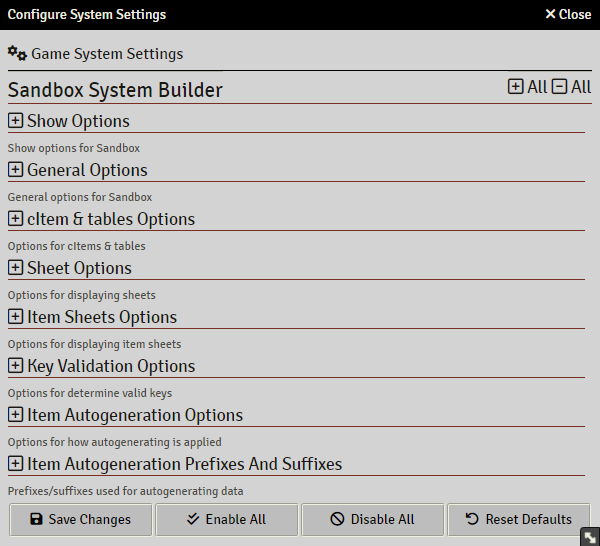
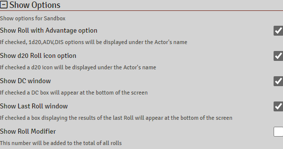
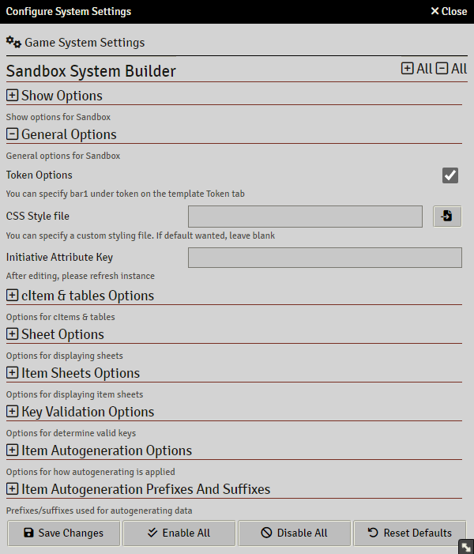
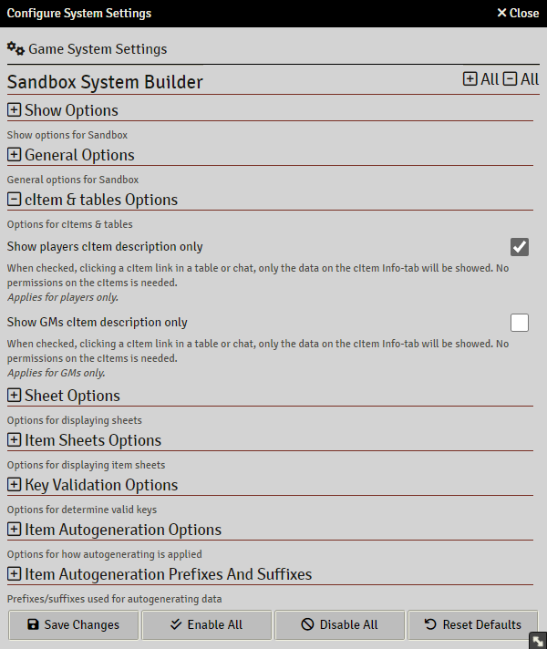
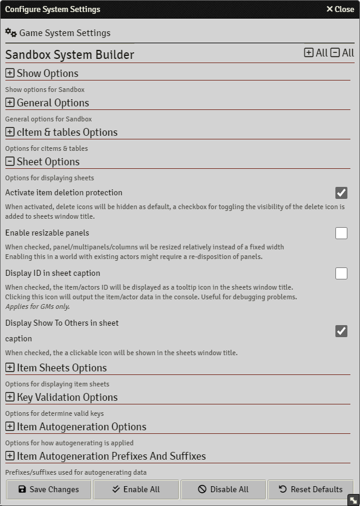
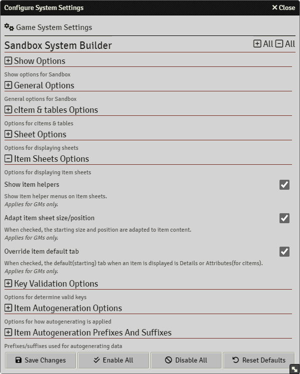
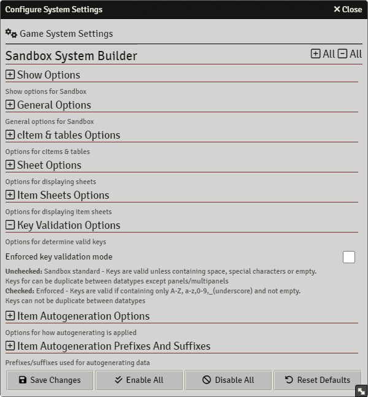
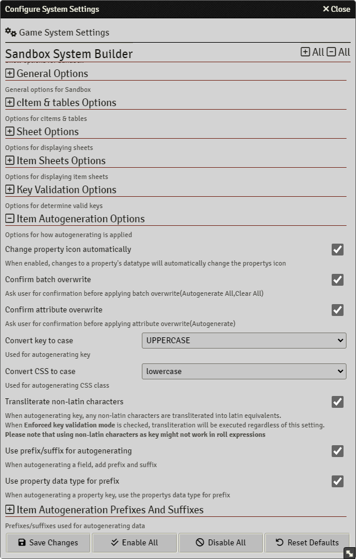
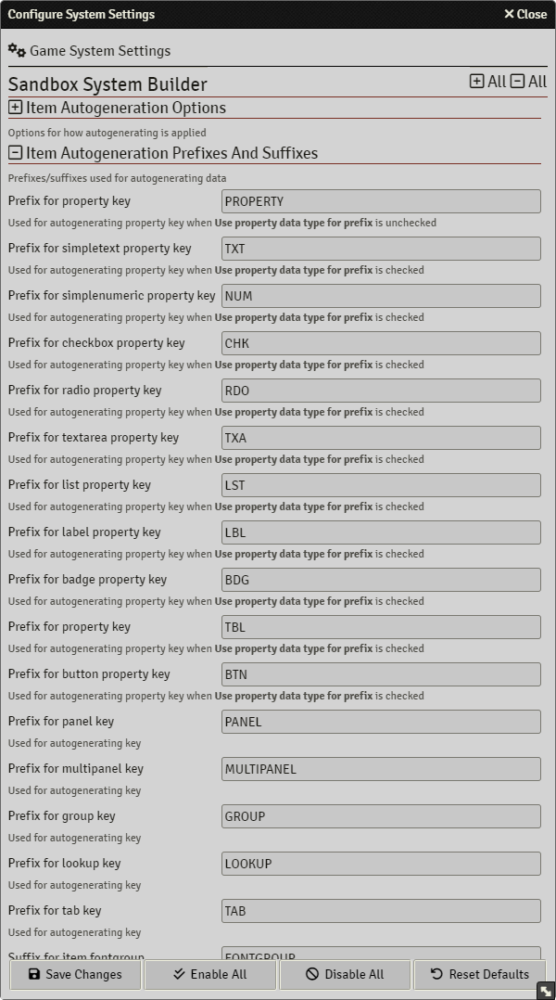

# Sandbox Settings

> These pages are under construction, if needed, please refer to the previous [README](readme_previous.md)

## Show Options

## General Options

## cItem & Tables Options

## Sheet Options

## Item Sheet Options

## Key Validation Options

## Item Autogeneration Options

## Item Autogeneration Prefixes And Suffixes

