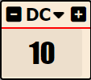

# Sandbox User Interface

## Sheets Title Bar

Sandbox adds three clickable captions to all items and actor sheets

### Icons(Show/Hide Delete/Add)

### Show(Info to others)

### Info

This is only shown if the option `Display ID in sheet caption` is enabled in Sheet Options in [Settings](sandbox_settings.md)
It is only shown to GMs.

When clicked, it will output the item/actors data to the Console(press F12).

For actors, CTRL+Click will display the Actor Properties Manager for that actor

## Actor Properties Manager

The Actor Properties manager is a useful tool to remove obsolete properties and otherwise troubleshoot actor properties problems.

## Difficulty Class

If enabled in Settings, this will display a box with a Difficulty Class number, usable in expressions as #{diff}

## Last Roll

If enabled in Settings, this will display a box with the last roll made

## Sandbox Toolbar